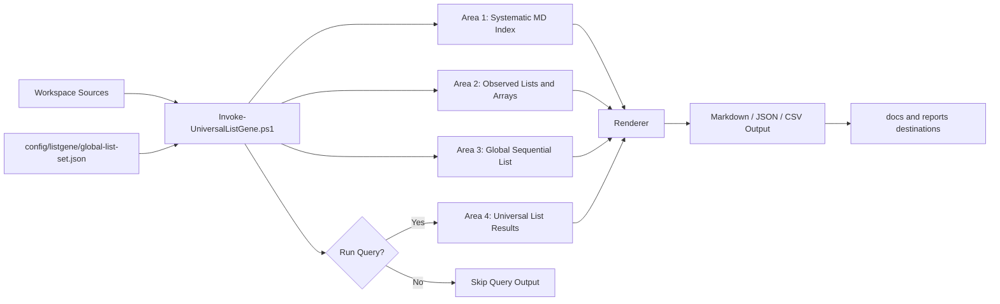
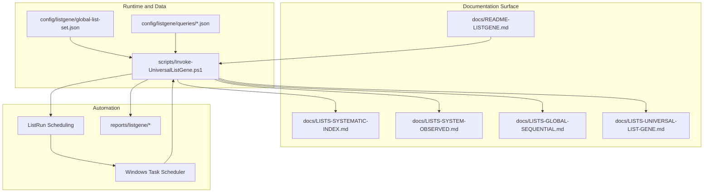

# ListGene README

VersionTag: 2605.B5.V51.1

This page is the dedicated operator guide for creating, regenerating, querying, and scheduling LIST outputs in PowerShellGUI.

## XHTML Tool Entry

Open the interactive UI page:

- `XHTML-ListGeneHub.xhtml`

The XHTML tool mirrors Workspace Hub visual patterns and renders all four list areas directly in-browser with sortable tables, query command builder, and ListRun scheduling command generator.

## Purpose

ListGene provides four list areas in one service:

1. Systematically indexed lists
2. System obtained lists and arrays
3. Global list set (sequential catalog)
4. Universal List Gene query engine

## Vector Flowchart: End-to-End Pipeline



## Vector Flowchart: Functional Application Mapping



## Area 1: Systematically Indexed Lists

Area 1 indexes every Markdown file in the workspace and reports:

- Path
- Line count
- Size in bytes
- Last write UTC

Run:

```powershell
pwsh -NoProfile -File .\scripts\Invoke-UniversalListGene.ps1 -Build -OutputFormat Markdown -OutputPath docs/LISTS-SYSTEMATIC-INDEX.md
```

## Area 2: System Obtained Lists and Arrays

Area 2 scans workspace files and detects list/array signals:

- Markdown bullet and ordered lists
- PowerShell array literals like `@(...)`
- Ordered dictionaries like `[ordered]@{ ... }`

Run:

```powershell
pwsh -NoProfile -File .\scripts\Invoke-UniversalListGene.ps1 -Build -OutputFormat Markdown -OutputPath docs/LISTS-SYSTEM-OBSERVED.md
```

## Area 3: Global List Set

The global list set is stored in:

- `config/listgene/global-list-set.json`

Categories included:

- mdIcons (name + value + unicode)
- emoji
- altCharacters
- hieroglyphics
- runes
- musicGenres
- atomicElements
- religions
- hormones
- medications
- cryptoCurrencies
- aiModels
- graphicsCards

Run:

```powershell
pwsh -NoProfile -File .\scripts\Invoke-UniversalListGene.ps1 -Build -OutputFormat Markdown -OutputPath docs/LISTS-GLOBAL-SEQUENTIAL.md
```

## Area 4: Universal List Gene Query Service

Area 4 is a crawler/scanner/searcher that can grep searched, known, or provided/refined data and output sorted, reviewable results.

Example query run:

```powershell
pwsh -NoProfile -File .\scripts\Invoke-UniversalListGene.ps1 -RunQuery -Query "icon|emoji|rune" -UseRegex -MaxResults 300 -OutputFormat Markdown -OutputPath docs/LISTS-UNIVERSAL-LIST-GENE.md
```

## Save Static List and Save Query

Save static list output and a reusable query definition:

```powershell
pwsh -NoProfile -File .\scripts\Invoke-UniversalListGene.ps1 -RunQuery -Query "AI|model|GPU" -UseRegex -SaveQuery -QueryName ai-hardware-scan -OutputFormat Json -OutputPath reports/listgene/ai-hardware-scan.json
```

Saved query files are written to:

- `config/listgene/queries/*.json`

## ListRun Scheduling

Register a scheduled ListRun:

```powershell
pwsh -NoProfile -File .\scripts\Invoke-UniversalListGene.ps1 -RegisterSchedule -TaskName "PwShGUI-ListRun-Scheduler" -DailyAt "02:00" -ScheduledOutputFormat Markdown -ScheduledOutputPath reports/listgene/listgene-nightly.md
```

Remove scheduled run:

```powershell
pwsh -NoProfile -File .\scripts\Invoke-UniversalListGene.ps1 -UnregisterSchedule -TaskName "PwShGUI-ListRun-Scheduler"
```

## Destination Routing Options

Use `-OutputPath` to route outputs to:

- Static docs under `docs/`
- Operational reports under `reports/listgene/`
- Export datasets under custom locations

Combine with normal workflow logging to save, display, send, or archive generated list outputs.
