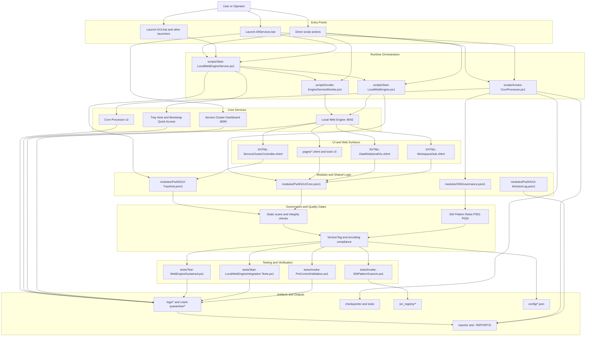

# Workspace Flow Diagram

This diagram maps the complete operational flow for the PowerShellGUI workspace, including launch paths, core runtime services, UI surfaces, governance, testing, and artifact outputs.

