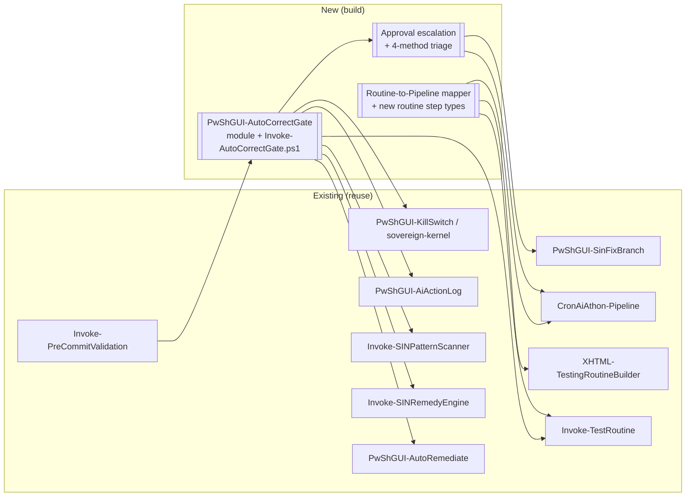
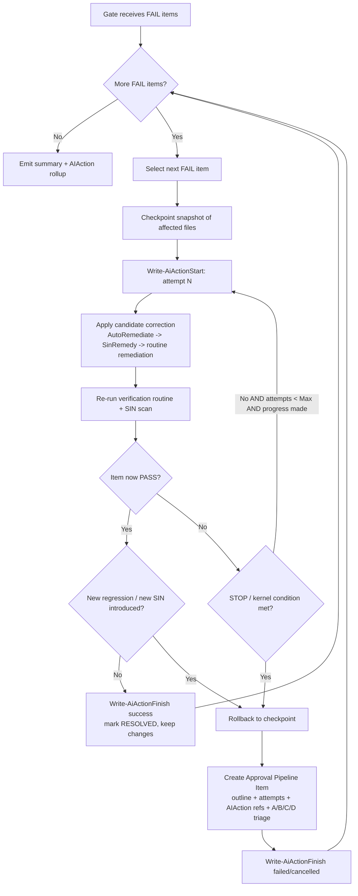
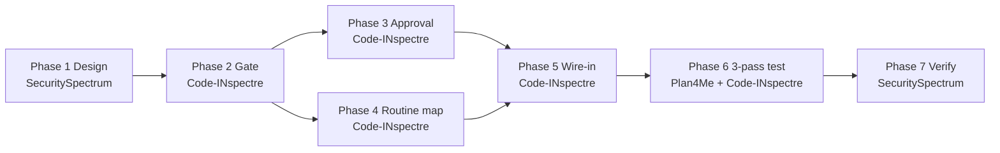

# PLAN — Auto-Correct Pipeline Gate, Approval Escalation & Test-Routine Mapping

- **Planner:** kpe-AiGent-Plan4Me
- **Created:** 2026-07-27
- **Target runtime:** PowerShell 5.1 strict (PS7.6-first / PS5.1-safe fallback)
- **Governance:** SIN charter compliant — icons per `~README.md/DOC-ICON-STANDARD.md`
- **Related files:** [XHTML-TestingRoutineBuilder.xhtml](scripts/XHTML-Checker/XHTML-TestingRoutineBuilder.xhtml), [Invoke-TestRoutine.ps1](scripts/Invoke-TestRoutine.ps1), [CronAiAthon-Pipeline.psm1](modules/CronAiAthon-Pipeline.psm1), [PwShGUI-AutoRemediate.psm1](modules/PwShGUI-AutoRemediate.psm1), [PwShGUI-AiActionLog.psm1](modules/PwShGUI-AiActionLog.psm1), [Invoke-PreCommitValidation.ps1](tests/Invoke-PreCommitValidation.ps1)

---

## 1. Objective (restated)

1. **Add an Auto-Correct pipeline gate** that iteratively attempts to fix *every* FAIL item — **unless** a hard STOP ("kernel") condition prohibits safe iteration: significant regression, a newly-introduced SIN, charter violation, paradox / oscillation, infinite-or-finite loop, or error / lockup / host crash / panic.
2. **Escalate un-fixable FAILs** into an **Approval Pipeline Item** containing: FAIL outline, integral components, auto-attempt log + learnings, linked AIAction records, and a **triaged 4-method remediation plan** — A) all-encompassing refactor, B) basic-fixes branch, C) cautious low-code compromise, D) dynamic agent-interactive diagnosis.
3. **Map existing test routines** into the pipeline module functions surfaced by the **Testing Routine Builder**.
4. **Exercise the pipeline on the workspace for three passes** and capture convergence.

---

## 2. Discovery — what already exists (grounding)

| Concern | Existing asset | Notes |
| --- | --- | --- |
| Gate execution model | [tests/Invoke-PreCommitValidation.ps1](tests/Invoke-PreCommitValidation.ps1) | 7 gates (`Invoke-*Gate`) returning finding objects w/ `Gate` property; exit 0/1 + JSON report. **Insertion point for the new gate.** |
| Pipeline item schema | [modules/CronAiAthon-Pipeline.psm1](modules/CronAiAthon-Pipeline.psm1) `New-PipelineItem` / `Add-PipelineItem` | OrderedDictionary; `type` ∈ FeatureRequest/Bug/Items2ADD/Bugs2FIX/ToDo; has `outlineTag/outlinePhase`, `countermeasures`, `bugHistory`. Registry: `config/cron-aiathon-pipeline.json`. |
| Batch processing | `Invoke-PipelineBatchCycle` | Status-driven advancement w/ stale→BLOCKED, `-WhatIf` support. |
| Safe auto-fix | [modules/PwShGUI-AutoRemediate.psm1](modules/PwShGUI-AutoRemediate.psm1) `Invoke-AutoRemediate` | Idempotent P002/P017/P018/P019 transforms, `-WhatIf`, BOM-preserving, excludes temp/.venv/.git. **Reuse as a corrector.** |
| Deeper remedies | [scripts/Invoke-SINRemedyEngine.ps1](scripts/Invoke-SINRemedyEngine.ps1), [modules/PwShGUI-SinFixBranch.psm1](modules/PwShGUI-SinFixBranch.psm1) `New-SinFixBranch` | Method **B** (basic-fixes branch) already exists. |
| AIAction logging | [modules/PwShGUI-AiActionLog.psm1](modules/PwShGUI-AiActionLog.psm1) `Write-AiActionStart/Finish/Record` | Schema `PwShGUI-AiActionLog/1.0`, JSONL under logs; `-IsTest` split. **Reuse for attempt logs.** |
| SIN detection | [tests/Invoke-SINPatternScanner.ps1](tests/Invoke-SINPatternScanner.ps1) | Regression / resultant-SIN detector for the STOP guardrails. |
| Test routines | [scripts/Invoke-TestRoutine.ps1](scripts/Invoke-TestRoutine.ps1) + [XHTML-TestingRoutineBuilder.xhtml](scripts/XHTML-Checker/XHTML-TestingRoutineBuilder.xhtml) | Schema `PsGUI-TestRoutine/1.0`, 22 condition types, saved under `tests/Testing-Routine-SAVES/`. |
| Regression guard | `CronAiAthon-Pipeline.psm1` §"REGRESSION GUARD", `Test-BugSinResolved` | Existing hook for regression comparison. |
| Kernel / kill-switch | [sovereign-kernel/](sovereign-kernel/), [modules/PwShGUI-KillSwitch.psm1](modules/PwShGUI-KillSwitch.psm1), `config/kill-switches.csv` | Source of "kernel condition" STOP authority. |
| Approvals | `config/chief-approvals.json`, [scripts/Invoke-AutoApprovalWriter.ps1](scripts/Invoke-AutoApprovalWriter.ps1) | Approval sink for escalated items. |

> **Reuse-first principle:** the new gate is an *orchestrator* over existing correctors, loggers, and detectors — not a re-implementation.

---

## 3. Target architecture



### 3.1 Auto-Correct gate control flow



### 3.2 STOP ("kernel") conditions — hard gates that abort iteration

| # | Condition | Detection signal | Action |
| --- | --- | --- | --- |
| K1 | **Significant regression** | verification/SIN scan shows *more* failing checks than baseline (> configurable delta) | rollback + escalate |
| K2 | **Resultant SIN** | `Invoke-SINPatternScanner` reports a new P-pattern in the edited file | rollback + escalate |
| K3 | **Charter violation** | edit touches protected path / kill-switch / sovereign-kernel ledger, or violates governance rule | rollback + escalate |
| K4 | **Paradox / oscillation** | fix flips between two states across attempts (content hash cycle detected) | rollback + escalate |
| K5 | **Loop cap / no-progress** | attempts ≥ `MaxAttempts`, or no reduction in failing checks for `StallAttempts` | rollback + escalate |
| K6 | **Error / lockup / crash / panic** | corrector throws, exceeds `PerItemTimeoutSec`, non-zero host exit, or unhandled exception | rollback + escalate |

> All STOP conditions are **fail-safe**: on trigger, the affected files are restored from the pre-attempt checkpoint before escalation.

---

## 4. Phased execution plan

### Phase 0 — Discovery ✅ (complete)

- **Goal:** ground the design in existing assets. **Done:** §2 inventory captured.

### Phase 1 — Design & governance contract

- **Goal:** freeze the gate contract, STOP-condition thresholds, approval schema, and 4-method triage schema.
- **Tasks:**
  1. Write `config/autocorrect-gate.config.json` (thresholds: `MaxAttempts`, `StallAttempts`, `PerItemTimeoutSec`, `RegressionDelta`, protected-path list, corrector order).
  2. Define approval-item extension fields (see §5) and the `triage` sub-schema (A/B/C/D).
  3. Register a design note in `sin_registry/` if a new pattern class is introduced; confirm no P001–P082 violations in the design.
- **Subagent:** `SecuritySpectrum` (STOP-condition + charter review) → hand back.
- **Blockers:** confirmation of protected-path list (sovereign-kernel + kill-switch scope).
- **Done when:** config + schema JSON reviewed and committed; no SIN drift.

### Phase 2 — Build the Auto-Correct gate

- **Goal:** implement the orchestrator gate.
- **Deliverables:**
  - `modules/PwShGUI-AutoCorrectGate.psm1` + `.psd1` — exports `Invoke-AutoCorrectGate`, `Test-KernelStopCondition`, `New-CorrectionAttempt`.
  - `scripts/Invoke-AutoCorrectGate.ps1` — CLI wrapper (`-WorkspacePath`, `-FailItems`/auto-collect, `-WhatIf`, `-MaxAttempts`, `-DryRun`).
- **Tasks:** iteration loop, per-item checkpoint/rollback, corrector chain (AutoRemediate→SinRemedy→routine remediation), post-attempt verification + SIN re-scan, STOP-condition evaluator, AIAction start/finish per attempt, summary object matching the gate finding shape (`Gate='AutoCorrect'`).
- **Subagent:** `kpe-AiGent_Code-INspectre` (implementation + checkpoints).
- **Blockers:** Phase 1 config/schema.
- **Done when:** module imports clean; `-WhatIf` dry-run produces attempt log without mutating files; unit test `tests/PwShGUI-AutoCorrectGate.Tests.ps1` green.

### Phase 3 — Approval escalation + 4-method triage

- **Goal:** convert un-fixable FAILs into approval items.
- **Deliverables:** `New-ApprovalPipelineItem` (in pipeline module or a thin adjunct) that builds the item per §5 and routes to `config/chief-approvals.json` via existing approval writer.
- **Tasks:** assemble FAIL outline, integral components (affected files + dependents from DependencyMap), attempts+learnings, AIAction refs, and generate the A/B/C/D triage with a recommended default.
- **Subagent:** `kpe-AiGent_Code-INspectre`.
- **Blockers:** Phase 2 attempt records.
- **Done when:** a forced-fail fixture yields a well-formed approval item with all five sections + 4 methods; Pester asserts schema.

### Phase 4 — Map test routines into pipeline functions

- **Goal:** make existing tests first-class routine steps the pipeline can invoke.
- **Tasks:**
  1. Add routine step types to the builder + runner: `RunPester`, `RunSinScan`, `RunValidationScript`, `InvokePipelineFunction`, `RunCanonicalPathCheck`.
  2. Generate routine JSON templates that wrap: `tests/*.Tests.ps1`, `Invoke-ComprehensiveValidation.ps1`, `Invoke-SINPatternScanner.ps1`, `Invoke-ValidateCanonicalPaths.ps1`, `validate-changes.ps1`.
  3. Surface the mapped pipeline module functions in [XHTML-TestingRoutineBuilder.xhtml](scripts/XHTML-Checker/XHTML-TestingRoutineBuilder.xhtml) (`TEST_TYPES` + dropdown + `Invoke-TestRoutine.ps1` executors). Respect **P032** (escape `</script>`/`</style>`/`]]>`) and **P033** (single top-level `var`).
  4. Persist generated routines to `tests/Testing-Routine-SAVES/` and register them so the gate can call them as verification routines.
- **Subagent:** `kpe-AiGent_Code-INspectre` (with `kpe-AiGent_IoT-NetOps` only if network step types are needed — not expected).
- **Blockers:** none hard; benefits from Phase 2 verification interface.
- **Done when:** each new step type executes from `Invoke-TestRoutine.ps1`; builder loads/saves without XHTML escaping SINs; ≥ N existing tests wrapped as routines.

### Phase 5 — Wire gate into orchestrators

- **Goal:** integrate without breaking existing gates.
- **Tasks:** add `Invoke-AutoCorrectGate` as an **opt-in** stage in [tests/Invoke-PreCommitValidation.ps1](tests/Invoke-PreCommitValidation.ps1) (behind `-EnableAutoCorrect`), and as a stage in [scripts/Run-FullPipeline.ps1](scripts/Run-FullPipeline.ps1) / [scripts/Invoke-PipelineContinuousRefine.ps1](scripts/Invoke-PipelineContinuousRefine.ps1). Default OFF to preserve current behaviour.
- **Subagent:** `kpe-AiGent_Code-INspectre`.
- **Done when:** existing gate exit semantics unchanged when flag off; new stage runs when on.

### Phase 6 — Three-pass workspace test

- **Goal:** exercise convergence over 3 passes.
- **Tasks:**
  - **Pass 1 (dry-run):** `-WhatIf` — collect FAILs, log intended corrections, no writes.
  - **Pass 2 (live):** apply safe corrections, escalate the rest, record AIAction + approvals.
  - **Pass 3 (live):** confirm convergence — fewer FAILs, no oscillation, stable approval set.
  - Capture a per-pass report under `reports/pipeline-autocorrect-gate/PASS-{1,2,3}-*.md` (fixed→escalated→remaining counts, regression delta, STOP-condition hits).
- **Subagent:** `kpe-AiGent-Plan4Me` coordinates; `kpe-AiGent_Code-INspectre` executes.
- **Done when:** 3 passes complete with a convergence table and no unresolved STOP/crash.

### Phase 7 — Verify, govern, record

- **Goal:** prove no regressions introduced by the work itself.
- **Tasks:** run `Invoke-SINPatternScanner` (refresh baseline w/ review), full Pester, encoding (P006 BOM) + VersionTag (P007) checks on all new/edited files; update `CHANGELOG.md` / `ENHANCEMENTS-LOG.md`; write repo memory note on the gate contract.
- **Subagent:** `SecuritySpectrum` (final audit) + self.
- **Done when:** SIN scan clean vs baseline, Pester green, docs + memory updated.

---

## 5. Approval Pipeline Item — schema extension

Built on `New-PipelineItem` (type `Bugs2FIX`, `source='AutoCron'`, `outlinePhase='assessment'`) with an appended `approval` block:

```jsonc
{
  "approval": {
    "requires": "chief",                 // routes to config/chief-approvals.json
    "failOutline": "…preliminary FAIL description…",
    "integralComponents": ["path/a.ps1", "path/b.psm1"],   // affected + dependents
    "autoAttempts": [
      { "n": 1, "corrector": "AutoRemediate:P017", "result": "no-pass",
        "learning": "…", "aiActionId": "…", "stopCondition": null }
    ],
    "aiActionRefs": ["ai-actions-YYYYMMDD.jsonl#actionId"],
    "stopCondition": "K2:resultant-SIN",
    "triage": {
      "recommended": "B",
      "methods": {
        "A": { "name": "All-encompassing refactor", "scope": "…", "risk": "high",  "effort": "high" },
        "B": { "name": "Basic-fixes branch",        "scope": "…", "risk": "low",   "effort": "med",  "tool": "New-SinFixBranch" },
        "C": { "name": "Cautious compromise (low code change)", "scope": "…", "risk": "low", "effort": "low" },
        "D": { "name": "Dynamic plan (agent-interactive diagnosis)", "scope": "…", "risk": "med", "effort": "var" }
      }
    }
  }
}
```

---

## 6. Change control

### Decisions

- D1: New gate is **opt-in** (default OFF) to protect current pipeline semantics.
- D2: Corrections are **checkpoint-guarded**; every STOP condition rolls back before escalation.
- D3: Reuse `Invoke-AutoRemediate`, `Invoke-SINRemedyEngine`, `New-SinFixBranch`, `Write-AiAction*` — no re-implementation.

### Assumptions

- A1: "kernel condition" authority = sovereign-kernel ledger + kill-switch + protected-path list.
- A2: FAIL items originate from existing gates / SIN scan / mapped test routines.
- A3: Approvals continue to flow through `config/chief-approvals.json`.

### Risks & mitigations

- R1 *Corrector introduces a SIN* → mandatory post-attempt SIN re-scan (K2) + rollback.
- R2 *Oscillation / infinite loop* → content-hash cycle + `MaxAttempts`/`StallAttempts` caps (K4/K5).
- R3 *Host crash on a bad file* → per-item timeout + try/catch isolation (K6), batch continues.
- R4 *XHTML edit breaks builder* → enforce P032/P033 on the builder edit; smoke-load after change.
- R5 *Encoding/VersionTag drift on new files* → Phase 7 P006/P007 verification.

---

## 7. Subagent allocation & sequencing



Phases 3 and 4 can run **concurrently** after Phase 2. All others are sequential.

---

## 8. Definition of done (whole task)

- [ ] Auto-Correct gate iteratively fixes FAILs with all six STOP guardrails enforced + fail-safe rollback.
- [ ] Un-fixable FAILs produce approval items with outline + components + attempts/learnings + AIAction refs + A/B/C/D triage.
- [ ] ≥ N existing test routines callable as pipeline routine steps; builder updated SIN-safe.
- [ ] Three workspace passes executed with a convergence report.
- [ ] SIN scan clean, Pester green, P006/P007 verified, changelog + memory updated.
