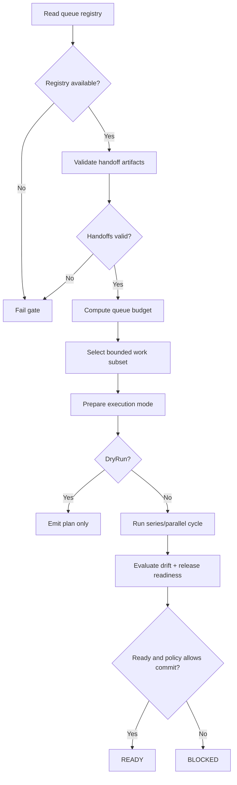

<!-- VersionTag: 2608.B1.V54.1 -->
<!-- FileRole: PlanHandoff -->
<!-- SchemaVersion: CronPipeFlow/1.0 -->

# Handoff — Iterative Pipeline Gate Plan

## Goal

Add an iterative pipeline gate that chooses a bounded amount of queue work, validates handoff readiness and drift, executes in a controlled series or parallel cycle, and blocks commit/release if the gate is not healthy.

This gate is intended to sit inside the repo’s existing pipeline discipline without changing default behavior until it is explicitly enabled.

## Source Grounding

The repo already contains the patterns needed for this gate:

- Full pipeline gating and fail-fast behavior in [scripts/Run-FullPipeline.ps1](scripts/Run-FullPipeline.ps1)
- Queue registry and pipeline item patterns in [config/cron-aiathon-pipeline.json](config/cron-aiathon-pipeline.json)
- Handoff and artifact validation conventions in [docs/CRON-PIPE-FLOW-PLAN.md](docs/CRON-PIPE-FLOW-PLAN.md)
- Existing gate-style reports and mapping in [reports/pipeline-autocorrect-gate/PLAN-AutoCorrect-Gate-and-Routine-Mapping.md](reports/pipeline-autocorrect-gate/PLAN-AutoCorrect-Gate-and-Routine-Mapping.md)
- Viewer and flow integration precedent in [XHTML-Cron-Pipe-Flow.xhtml](XHTML-Cron-Pipe-Flow.xhtml)

## Design Summary

### Gate responsibilities

The gate must:

- read the active queue registry
- validate required artifacts and handoff evidence
- enforce safe batching limits
- select eligible OPEN or PLANNED items only
- run execution in either `Series` or `Parallel` mode
- re-check drift and release criteria before permitting commit
- return a structured `Checks[]` result for pipeline integration

### Result contract

Return a PowerShell object with these core fields:

- `status` = `READY`, `BLOCKED`, or `ERROR`
- `cycleId`
- `checks[]`
- `queueSnapshot`
- `execution`
- `allowCommit`
- `exitCode`

### Required checks

The gate should emit at least these checks:

1. `RegistryPresent`
2. `QueueDepth`
3. `HandoffValidation`
4. `ResourceBudget`
5. `ExecutionPlan`
6. `DriftGate`
7. `CommitGate`
8. `GateRuntime`

## Execution Flow



## Hard stop conditions

The gate must abort iteration and escalate instead of endlessly looping when any of these are triggered:

- significant regression
- new SIN introduced by the work
- charter or governance violation
- paradox / oscillation across attempts
- loop cap reached or no-progress stall
- runtime crash, lockup, or timeout

## Policy defaults

Recommended default values:

- `MaxItemsPerCycle = 25`
- `MaxIterations = 3`
- `MaxParallelSets = 2`
- `ExecutionMode = 'Parallel'`
- `FailOnDrift = $true` when release gating is active
- `AllowCommit = $false` unless pass state is confirmed

## Implementation plan

### Phase 1 — Gate contract and policy

- define the `Checks[]` contract and status semantics
- set the default runtime policy thresholds
- confirm required queue and artifact paths
- ensure no SIN or governance violations are introduced by the design

### Phase 2 — Iterative execution logic

- implement the queue snapshot function
- implement the handoff validation function
- implement budget and work selection logic
- implement execution-mode planning logic
- return the standardized gate result object

### Phase 3 — Release gating and drift enforcement

- evaluate drift artifact state before allowing commit
- emit pass/warn/fail states with useful detail messages
- integrate the gate in the full pipeline sequence

### Phase 4 — Verification and evidence

- run the gate in dry-run mode before live execution
- verify repeated runs produce stable outputs
- validate drift block behavior in strict mode
- confirm exit codes and logs match policy

## File deliverables

Planned scope for the implementation:

- `scripts/Invoke-IterativePipelineGate.ps1`
- `modules/PwShGUI-IterativePipelineGate.psm1`
- `config/pipeline-iterative-gate.json` or equivalent policy file
- gate log/report artifacts under `reports/` or `logs/`
- integration hooks in [scripts/Run-FullPipeline.ps1](scripts/Run-FullPipeline.ps1) and the relevant pre-commit validation flow

## Acceptance criteria

The deliverable is considered complete when all of the following are true:

- the gate returns a structured object with `status`, `checks`, and `exitCode`
- no work is selected beyond the configured item budget
- the queue registry may be absent or empty without silently passing
- handoff failure blocks the gate
- drift failure blocks release when `FailOnDrift` is enabled
- dry-run mode reports the plan without mutating state
- `READY` only occurs when all required policy checks are satisfied
- previously failing pass conditions can be reproduced and verified again

## Ownership and handoff contract

Execution ownership:

1. `FocalPoint-null-00`: orchestration and acceptance
2. `Code-A-planR`: source config and execution-map curation
3. `Code-B-iSmuth`: implementation of the gate logic and report generation
4. `Code-B-Tsted`: dual-engine verification and trace evidence
5. `ProxySecurity`: validation of path, input, and execution boundaries

Phase evidence requirements:

- each phase writes a checkpoint
- each phase retains proving command output
- repeated failure with the same root cause escalates with the gate report and failing checks

## Proving commands

Use these as the completion evidence set:

```powershell
pwsh -NoProfile -ExecutionPolicy Bypass -File .\scripts\Invoke-IterativePipelineGate.ps1 -WorkspacePath . -DryRun
pwsh -NoProfile -ExecutionPolicy Bypass -File .\scripts\Invoke-IterativePipelineGate.ps1 -WorkspacePath . -FailOnDrift
pwsh -NoProfile -ExecutionPolicy Bypass -Command "Invoke-Pester -Path '.\tests' -Output Detailed"
```

## Release note

This gate should remain opt-in during rollout to avoid changing the current workflow unexpectedly. Once the gate is proven stable, it can be promoted to a default blocking stage in the full pipeline and pre-commit validation sequence.

## Summary

The repository already has a strong pipeline architecture and gate conventions; the iterative gate should extend that pattern rather than replace it. The safest implementation is a bounded, observable, fail-closed gate that validates registry state, handoff health, drift, and commit policy before allowing work to continue.
